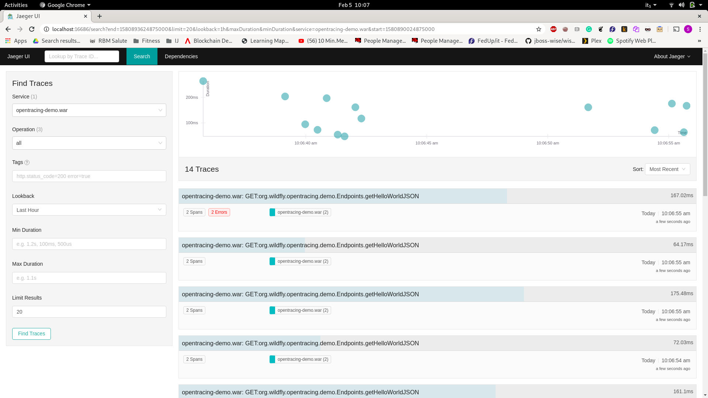

# observability-app
Simple Web Application to demonstrate WildFly Observability capabilities
This application is a simple JAXRS endpoint producing XML or JSON and failing randomly.

# How to use it

Ecplispe MicroProfile open tracing capabilities in WildFly could be used out of the box with no configuration, as described in next 4 steps
It is also possible to change configurations from CLI for advanced use as descibed in this article: https://wildfly.org/news/2020/02/03/Micro_Profile_OpenTracing_Comes_To_WildFly/ 


## 1. Start Jaeger tracer using docker
```bash
docker run   --rm   --name jaeger   -p6831:6831/udp   -p16686:16686 jaegertracing/all-in-one:1.6
```

## 2. Start WildFly
```bash
cd $WILDFLY_HOME/bin
./standalone.sh
```
## 3 build and deploy this sample
```bash
mvn clean package wildfly:deploy
```

## 4 invoke REST endpoits
Now, you can navigate to link: http://localhost:8080/opentracing-demo to access the deployed application. Generate a few races by clicking on the links several times.

## 5 see the results in jaeger
Now open the link:http://localhost:16686 and search for traces related to the service *opentracing-demo.war*, you should see the result of your previous actions.

